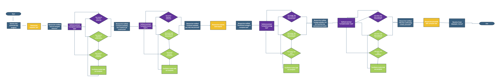

# Facilitator Instructions

Run! for Runtime is an exercise to help make visible the hidden impacts of using computing for research.

It is designed to be run by a facilitator and a group of at least four participants, but it works better with a larger number of people. The exercise can be adapted to run in-person, online or hybrid. It could be run fully offline using physical prompts e.g. printed cards for each task.

Index
- Terms
- 

## Terms

We use the following terms in these instructions

PLAYERS

- Researcher: the person(s) that run the computational job.
- Gatherers: the person(s) that enable the job to run.
- Facilitator: the person(s) who looks after the job, ensures that the gatherers know what to do, and checks the evidence matches the resources.

ITEMS

- Resources: the things gatherers gather so the job runs, via a task.
- Evidence: the proof that the resources have been gathered so the task can complete.

TASKS

- Task: the action of a gatherer evidencing resources.

## Game logic

The exercise is structured as a series of stages, representing different categories of challenges to providing computation.

Information is presented unequally, with the researcher seeing a different view to the gatherers. This is to represent the hidden nature of the impacts, where the researcher may be unaware of the impact they are having on the environment or other parts of society.

### Setup

One participant is chosen as the researcher by the facilitator, the others are gatherers. This can be done randomly using the application, or manually by the facilitator. 

The researcher is presented with one set of information, normally through a screen. The gatherers are presented with a different set of information, either through their own individual screens or through a shared screen. It is important that the researcher cannot see the information on the gatherers screen; it is okay / desirable for the gatherers to see the researchers screen.

The researcher is initially presented with a prompt asking them to type in a query which Al-Gore-Rithm, the friendly AI research assistant will help them with. When they start this query, the exercise begins.

### Stages

The exercise goes through a series of stages, representing different things that are required to make a computational job run:

- Materials: required to create the hardware
- People: who provide labour and knowledge
- Energy: for powering the data centre
- Water: needed for cooling the data centre

For each stage, a set of one or more tasks are given to the gatherers, while the researcher waits. Once the task has been successfully completed, the exercise moves on to the next stage.

The facilitator may choose which of the set of tasks to use, depending on the audience.

